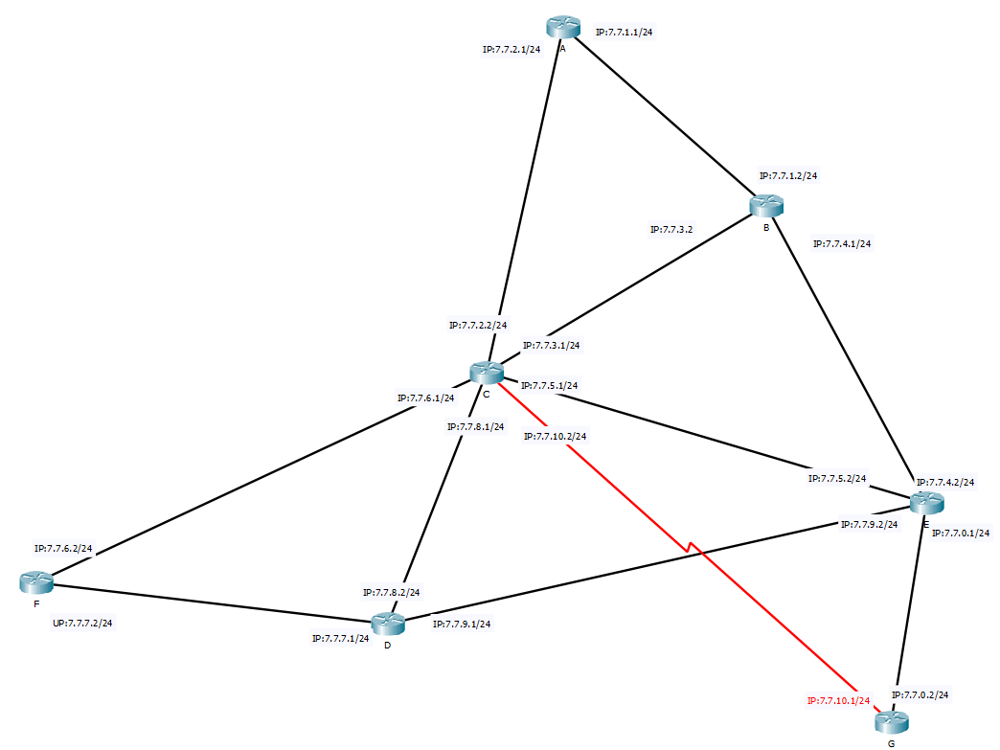

# 计算机网络课程项目二——虚拟路由

[TOC]

| 组员一 | 王永锋 | 16337237 | 评分：100 |
| ------ | ------ | -------- | --------- |
| 组员二 | 颜彬   | 16337269 | 评分：100 |
| 组员三 | 李新锐 | 15323032 | 评分：100 |

## 项目介绍
本次项目，我们实现了以下工作：
1. 实现了自组织虚拟路由程序。每个运行的虚拟路由程序充当router和client的角色，能够向虚拟网络中其他路由器发送消息，并路由转发其他路由器的消息。
1. 实现基于不同算法（LS和DV）的路由协议（OSPF和RIP），能够自动构建和维护各虚拟路由程序中的路由表。尝试了不同的网络拓扑验证了协议的正确性。
1. 实现了处理网络中其他路由节点下线或链路费用变化的情况。
1. 实现了中心化虚拟路由程序。
1. 仿照锐捷路由器，实现了友好的命令行用户界面。借助Tmux编写了一键测试脚本。

关于本项目代码仓库，可见[github:virtual-routing-demo](https://github.com/WalkerYF/virtual-routing-demo)。

项目介绍与测试主页，可见我们服务器上的主页[virtual-routing-demo](http://wangyf.top/p/pre/virtual-routing-demo/)。如果在中大内网，可访问[内网服务器](http://172.18.33.233/p/pre/virtual-routing-demo/)，加载速度更快！

## 项目设计
我们使用python3.5 ，在TCP socket的基础上，模拟了链路层和网络层的工作，并在自己实现的虚拟网络层的接口之上增加了不同的路由选择协议用作路由表的自动配置与动态更新，用于完成路由转发的工作。
### 总体架构
因此本次项目我们采用了分层设计的基本方法。
我们将程序分三层：
1. 虚拟链路层：管理邻居路由器直连端口（Interface）之间的子网。之所以称之“虚拟”链路层，是因为它通过TCP socket实际执行了直连Interface之间的数据通信。
向网络层提供了`DataLinkLayer.send`和`DataLinkLayer.receive`两个接口。
2. 网络层：读取到IP数据报后，根据目的IP确定是否转发。保存了路由表，根据路由表修改要转发的IP报的下一跳地址。同时，还对从虚拟链路层收到的IP报进行多路分解，让运行在网络层上的多个进程只接收到自己需要处理的数据报。
网络层中不涉及任何具体的数据发送工作，只是调用虚拟链路层的接口。因此在真实的路由设备上，适配“真实”链路层接口后，我们网络层及以上的代码应当是可以工作的。
3. 路由协议：从网络层接收路由协议报文，根据其中反映的当前网络信息，对路由表进行构建和维护。

整体而言，我们实现了链路层，网络层，并在网络层提供的接口上实现了路由选择协议。


### 虚拟链路层的设计
我们设计的虚拟链路层模块为网络层提供了直接相邻的Interface之间的数据传输的接口。从接口和功能上看，它与实际的链路层是相同的。

然而其实现上则有别与真实的链路层，因此冠名“虚拟链路层“：
该模块实际上一并完成了链路层和物理层的功能。
该模块使用的是TCP socket完成数据发送接收。

本实验中，我们将网络拓扑中每一条连接两个路由器的线段看做一个子网，该子网由分属两个路由器的直连Interface组成。
在配置文件中，我们为每一个Interface分配了一对虚拟的IP地址和虚拟子网掩码以及一对用于建立socket连接的物理机IP和端口号。

举下图例子：路由器A和路由器B是邻居路由，两者的Interface1相连，A的Interface 1的虚拟IP为8.8.1.2，B的为8.8.1.3，虚拟子网掩码均为24，组成8.8.1.0/24子网。物理机IP均为127.0.0.1，端口分别为6012和6013，链路层初始化时路由器A/B会分别启动一个监听线程，监听自身的(物理IP, 端口号)，并向对方的(物理IP,端口号)发起TCP socket连接。

我们将TCP socket提供的可靠字节流抽象成物理链路的连接。并在实现链路层的过程中，将该从TCP socket获得的长连接封装到链路层中，从而对外体现为：将IP包交给链路层，链路层就能够通过该IP包中含有的信息，得知通过哪一条链路发送。

**注意**：在我们的虚拟链路层设计中，我们抛弃了MAC地址，没有采取在IP包上新加一层以太网帧首部，而是将下一跳IP直接写在IP包中，直接根据下一跳IP确定链路层转发目的地。
#### 虚拟链路层的实现
虚拟链路层的实现在`src/link.py`中，该文件中有4个类
``` python
class Host():
    ...
class Subnet():
    ...
class HostManager():
    ...
class DataLinkLayer():
    ...
```
Host类表示子网内的一台主机。在本实验中，所有Host均为路由器的Interface。
其属性包括
``` python
name                         #该Interface所属路由器
counter_name                 #直连Interface所属路由器
link_cost                    #链路代价
vip                          #虚拟IP
netmask                      #虚拟子网掩码
counter_vip                  #直连Interface的虚拟IP
counter_netmask              #直连Interface的虚拟IP子网掩码
pip_port                     #物理IP和端口号
counter_pip_port             #直连Interface的物理IP和端口号
server_socket                #该Interface监听的socket
counter_socket               #向直连Interface发送消息的socket
status = "down"              #状态<down, on, offline>
```
Subnet类储存了一个Host列表和子网前缀
HostManager的构造函数要求传入路由器所有Interface的列表。构造函数开启会每个Interface的监听线程，然后初始化链路层子网列表。然后开启一个后台线程，调用self.connect_all函数，该函数，采用轮询的方法尝试和所有直连Interface建立TCP连接，直到和所有直连Interface均连接成功。成功连接得到的socket将储存在对应Interface中。

DataLinkLayer类提供两个接口
``` python
def send(self, ip_pkg:bytes) -> int
def receive(self) -> Optional[bytes]
```
send函数读取ip_pkg中的dest_ip和netmask。dest_ip在网络层表示下一跳IP，但也允许是出接口IP。根据dest_ip和netmask，send遍历找到对应的Interface。使用socket进行发送。

recieve函数从socket中读取ip_pkg放入link_buf队列中。
我们这里复用了上次CS通信实验中实现的rdt_socket类，使用定长头部的方法解决TCP粘包/分包问题。

### 网络层的设计
以下简单地描述网络层的设计。
#### 网络层提供接口
在链路层提供的接口基础上，网络层需要完成以下工作：
从IP包中获得最终目的IP，并通过查询转发表得到下一跳IP，将该下一跳IP写入IP包中，并将该IP包放入链路层发送。
从链路层获得接收到的IP包，并根据IP包中包含的协议信息，进行多路分解，交给对应的进程处理。
据此，网络层提供了以下接口
``` python
发送数据包
network_layer.send(源ip，最终目的ip，所需发送数据)
非阻塞地接受普通包
network_layer.recv()
非阻塞地接受RIP协议包
network_layer.recv_rip()
非阻塞地接受COST协议包
network_layer.recv_cost()
非阻塞地接受OSPF协议包
network_layer.recv_ospf()
非阻塞地接收ping协议包（本协议是网络层协议，功能与应用层的icmp协议类似）
network_layer.recv_ping()
```
#### IP包格式
IP包的格式我们在原有IPV4协议包的基础上，做了一些改动。下图展现了我们所实现的IP包的格式。

其中比较重要的字段我们做以下进一步说明
src_ip:发送源IP，在创建IP包的时候就需要写好该项的值
final_ip:发送目的IP，在创建IP包的时候就需要写好该项的值
dest_ip: 下一跳IP ,该项由网络层在转发表中查询后填入

上层协议类型
119：OSPF协议
120：RIP协议
#### 转发表格式
转发表的格式如下，这个可以在路由器控制台中通过show route命令来查看。
其中本地端口IP和本地连接的子网在路由器开机初始化的时候设置好，其他的表项可以手动添加，也可以通过路由选择协议自动填入。

#### 网络层转发逻辑
当网络层需要发送一个数据包，根据包中附带的最终目的IP，从转发表里根据最长匹配原则找到下一跳IP，如果从转发表中找到了对应的下一跳IP，则将该下一跳ip写入IP包的dest_ip项中。

其中最长匹配原则，使用了以下的逻辑来实现
判断转发表项是否可用：将目的IP与该转发表项子网掩码相与，并且将可达子网IP与对应子网掩码相与，若两者相等，则该子网可达目的IP，该表项可用。
计算匹配位数，取最长：目的子网与最终ip进行同或，计算前导1的个数，取个数最多的可用表项。

由此，实现了路由转发表中的最长匹配。
### OSPF协议的实现
在OSPF协议中，每个路由在上电（程序启动）后，即具有整个网络的所有信息。每个路由独自地执行最短路算法，求出到每个结点的最短路径。根据算法的结果在路由表中增添需要的表项。
#### 最短路的实现
在OSPF算法中，实现了两个接口
第一个接口的作用是初始化全局的拓扑信息（用邻接矩阵的形式储存）
``` python
def init_shortest_path_prerequisite(src : int) -> None:
```
第二个接口的作用是根据全局拓扑图计算出最短路
``` python
def calculate_shortest_path(src:int):
```
在路由器运行时，有可能部分路由会离线。在离线后只需要相应地修改全局拓扑信息，并使用第二个接口计算出最短路，即可重置路由表，让剩余的路由器正常工作。

#### 信息的监听和发送
本协议中将使用下述线程完成特定的任务。
``` python
class TrackingNeighbourAlive(threading.Thread):
```
该类在运行时将产生一个独立的线程，反复确认路由的邻居是否在线。这是通过反复向相邻的路由发送协议号为119的请求IP包实现的。IP包的有效载荷是一个`dict`, 其code字段为0.当其他路由收到该IP包时，会返回一个code字段为1的响应包。这样路由就可以知道其邻居的存在。

更详细的技术细节是，每次收到邻居的响应包，就将邻居的`alive`置位。每隔一定时间检查`alive`是否被置位，若是则说明邻居存在：将`alive`复位成0,等待下一次检测。若`alive`未被置位，则说明邻居长时间未回应包，此时可以认为邻居已断开链接。

每个路由结点仅维护和相邻结点的连接信息。路由检测到某个邻居断开连接后，需要将邻居的下线信息广播到整个局域网。

下列多线程类负责监听网络层的数据包。
``` python
class NetworkLayerListener(threading.Thread):
```
其会非阻塞地反复监听网络层送上来的数据。按照协议类型，接受ospf型数据包、ping型数据包和其他（无协议）数据包。用户可以通过调用不同的接口指明获取一种数据包。

ospf协议（协议号119）数据包负责广播某个结点的下线信息。
``` python
msg = {
    "type": "logout", # 代表下线
    "index": index, # 代表下线的路由器编号
    "id": msgID # 消息id。用于防止无限洪泛的发生
}
```
ping数据包（协议号100）负责侦查结点的邻居是否仍在线。
ping协议 请求格式
``` python
msg = {
  'code': 0,
  'msg': "are you still here?"
}
```
ping协议 响应格式
```python
 msg = {
    'code': 1,
    'msg': 'I am here.'
}
```
其他类型数据包（协议号0）负责在路由间交换信息（和用户在路由器终端测试路由时向其他路由发消息）
```python
msg = {
    anything
}
```
#### 广播
广播采用洪泛的方式实现。每条广播信息有一个唯一个的id。每个路由器缓存收到过的id。若路由器再次收到该id的信息，则直接丢弃该信息。

每个路由器有自己的消息id「定义域」。路由器从自己的消息定义域中选取id号，如此即可保证各个id之间互不相同。

当一个路由器收到广播信号，得知网络拓扑改变时，它会更新自己缓存的网络拓扑，重新执行一次最短路算法，并重置路由表。这个实现虽然效率不高，但能确保绝对正确。


### RIP协议的实现:
RIP协议是以DV算法为核心的分布式路由协议。本实验中主要在RIP类中实现。

下面我将从四个方面讲解RIP协议：

1. RIP协议维护的数据结构
2. RIP协议初始化过程
3. RIP报文的结构
4. 收到报文后的处理流程

RIP类中需要维护以下数据结构：

``` python
route_name: string            		 	#本路由器名
interfaces: list<Host>         			#本路由器的interfaces
tear_down:  list<string>       			#整个网络中处于离线状态的路由器列表
dis_vec:   dict<route_name: (cost, path)>#自身的距离向量(distance vector)
dis_mat:   dict<route_name: dis_vec>    #距离表(distance matrix)
topo:      dict<route_name: Subnet>     #已知的网络拓扑
```
RIP协议在网络层初始化完毕后启动。RIP协议启动时（即RIP类构造时），只需要知道本地链路的信息，并用本地链路信息初始化以上条目。各条目的意义和初始情况为：

- route_name和interfaces由网路层传入，RIP类把它保存下来方便之后的引用。
- dis_vec是字典类型，其中每一字典项不仅存储了到某个路由器的路径费用，还存储了路由路径，用于实现毒性逆转。初始化时在dis_vec中添加与直连路由器直接的字典项。
- dis_mat在初始化时为空，之后它将储存邻居的RIP报文中的dis_vec，但不会包含自身的dis_vec。
- 由于路由表是以目的子网为表项的，因此RIP协议中，在找到与某个路由器的最短路径时，只有当知道这个路由器的Interfaces连接着哪些子网，才能更新路由表。这中信息储存在topo变量中。

RIP协议通过发送RIP报文更新路由表。因此接下来将开启后台广播线程，隔指定时间通过所有本地Interface，向所有邻居路由器发送RIP报文。

RIP协议报文包含的内容为：
``` python
rip_msg = {
    "from" : self.route_name,    
    "topo": self.topo,           
    'tear_down': self.tear_down, 
    "dis_vec": self.dis_vec           
}
```
网络层的NetworkLayerListener类会监听网络层收到的IP数据报并判断数据报协议类型。如果发现收到的是RIP协议报文，将会调用RIP.process函数处理该报文。

RIP.process函数是RIP协议的重点，在收到RIP报文（rip_msg）后它的处理过程共分五步：

1. 检查RIP报文的所有项，如果该项和已知的离线状态的路由器有关，则抛弃该报文。
2. 检查rip_msg中邻居的tear_down列表，确认是否又有其他路由器离线了，如果有，则删除自身维护的数据结构中与该离线路由器相关的项。
3. 检查rip_msg中邻居的距离向量，如果有其中某些键（route_name）不在自身的距离向量的键中，则说明发现了新的与自身不直接相连的路由器，更新自己的距离向量和拓扑图。
4. 用rip_msg中新的邻居距离向量更新自身在距离表中储存的旧值。
5. 根据更新过的距离向量和距离表，计算新的到所有已知路由器的最短路径并更新路由表。

第1、2步确保了一个路由器offline的消息会自该offline路由器向外扩散。
第3步使得一个路由器获得邻居路由器之外的路由器的信息，逐步学习到整个网络的拓扑。
第5步执行了dv算法，该算法基于以下公式，其中$D_x(y)$指从路由器x到路由器y的最短路径。
集合v是x的邻居路由器集，c(x,v)是x到v的费用。$D_v(y)$是从v到y的费用。
在算法的实现过程中，若不存在从v到y的路径，则将$D_v(y)$看做无穷大。
$$D_x(y) = \min_y\{c(x,y)+D_v(y)\}\ \ \ for\ each\ y\in N$$

同时，由于我从一开始就储存了路径信息，因此我实现了毒性逆转，若v到y的路径中包含x，则也将$D_v(y)$看做无穷大。

### 中心化路由选择协议的实现

项中心化路由选择协议的实现比较简单。中心路由器（controller）获取全局路由器的信息，并计算出多源最短路。其他路由器向controller发送路由转发表请求，controller为各个路由器返回对应的路由转发表。路由器根据controller提供的信息配置自己的转发信息。

请求报文
``` python
msg = {
    "code": 0,
}
# 0表示请求报文    "msg": "request for route table",
# 面向用户的提示信息    "src_index": ROUTER_INDEX
# 本路由在局域网中的编号 
```
在controller接收到请求报文后，其计算出最短路，返回下列响应报文。# 响应报文
``` python
msg = {
    "code": 1, # 1代表响应报文
    "msg": "here's your route table", # 面向用户的提示信息
    "route_table": [
      # 由下一跳ip，目的ip和掩码构成的三元组（的列表）
      (dst_ip, final_ip, netmask) 
    ]
}
```
## 安装及部署
### 运行方式
可从github上获取源代码，该源代码库与我们的提交文件中的source文件夹一致。
以下为命令行操作，也可在source文件夹下运行
获取源代码
``` shell
$ git clone https://github.com/WalkerYF/virtual-routing-demo
$ cd virtual-routing-demo/
```
运行测试样例
``` shell
cd test/ # 也可以cd test2/ 使用另一个测试样例
./test_rip.sh # 或者 ./test_odpf.sh 使用另一种路由选择协议 
```
### 依赖
我们的测试与源代码依赖着一些第三方的软件与库，因此初次运行也许不能成功。
测试脚本的正常运行，依赖于终端管理程序tmux，在ubuntu下可以按以下指令安装
``` shell
sudo apt-get install tmux
```
python程序的正常运行，依赖着一些第三方库，可在命令行下如此安装
注意安装在python3环境下。如果pip对应python2的环境，请使用pip3
``` shell
pip install bitarray
pip install prompt_toolkit
pip install pandas
```
### 配置文件说明
每一个路由器的配置文件都放在了测试文件夹下（形如routeA.json，这些配置文件说明了每一台路由器的直连端口及该端口连接的其他路由器的ip，因此，这些配置文件与测试文件夹中的拓扑图配套使用。当然，如果需要对拓扑进行修改，也可以通过修改配置文件来实现。
## 项目结果
### 测试方法
在我们的测试过程中，主要使用了两种测试拓扑。对每一种拓扑，我们均使用了多种路由选择协议进行了测试，验证了我们实现的协议的正确性。同时，我们对每一个测试，均有相关的测试脚本以及测试视频，帮助其他想要测试本项目的人来复现。

在`test/test2/test*`文件夹下，运行以下的脚本（依赖tmux）即可进行测试。
``` shell
./test_rip.sh # 可用于测试rip协议
./test_ospf.sh # 可用于测试ospf协议
./test_controller.sh # 可用于测试中心化路由，
中心化路由对网络拓扑结构有要求，因此必须在test_controller文件夹下测试
```
### test文件夹

#### test2文件夹

### test_controller文件夹


### 测试项目一：虚拟路由器的静态路由配置
在实现路由选择协议前，我们实现了虚拟的链路层及网络层，在这些层提供的接口之上，我们实现了一个能够对路由器各项属性进行查看及配置的控制台，以下视频是我们的测试结果。

**测试视频见**
`/ppt+demo_video/console_路由器控制台测试.mp4`

在我们的路由器控制台中，提供了以下命令，在视频中我们逐个进行了测试，并且还对转发表进行了设置以达到路由器间能够转发消息的结果。

``` shell
show route # 查看路由表
show interface # 查看接口情况
show tcp # 查看底层TCP socket的情况
show dv # 在RIP协议中可用，用于查看距离向量表
add (dest_net) (net_mask) (next_ip) # 用于在路由表中新增一项 
delete (dest_net) (net_mask) # 用于在路由表中删除一项
send (src_ip) (final_ip) (data) # 用于发送消息到指定路由器(功能与ping类似)
recv # 从本地队列中取得一个IP包并显示
```
### 测试项目二：RIP协议
RIP协议是一个使用距离向量算法进行路由表自适应配置的协议。我们主要测试了该协议在以下三个场景处所起的作用。

场景1：【路由器刚开机】每一个路由器都只有本地链路的信息。此时开启RIP协议后，每一个路由器应该要不断地广播距离向量直至收敛，同时转发表也能够设置好。
**见视频：**
`/ppt+demo_video/rip_路由器自动配置转发表.mp4`

场景2：【网络拓扑结构改变】此时路由器应该发现结构的改变并修改距离向量表，转发表，同时广播改变。
**见视频：**
`/ppt+demo_video/rip_路由表自适应更新网络拓扑.mp4`
场景3：【链路费用改变】此时路由器可能会发现一条更优的路径，修改距离向量和转发表，并广播此改变信息。
**见视频**
`/ppt+demo_video/rip_链路费用改变.mp4`
### 测试项目三：OSPF协议
OSPF是一个使用SPFA算法，通过全局拓扑信息计算得到最优的路的协议。对该协议的测试我们分为以下两个场景：
场景1：【路由器刚开机】每一个路由器都只有本地链路的信息。此时开启OSPF协议后，每一个路由器应该能够得到全局的拓扑信息，并且设置好本地的转发表。

场景2：【网络拓扑结构改变】此时路由器应该发现拓扑结构的改变并修改本地存储拓扑结构的数据库，转发表，同时广播此改变信息。
**以上两个场景的视频见**
`/ppt+demo_video/ospf_路由表自动配置及动态更新.mp4`
### 测试项目四：中心化路由
中心化路由让每一台路由器不再需要计算转发表，相反，每一台路由器只需要定时向中心路由请求自己的路由表即可。对该实现，主要测试了以下这一个场景。
【路由器刚开机】每一个路由器从中心化路由器得到转发表，从而实现路由器间的连同。

**见视频**

`/ppt+demo_video/中心化路由.mp4`

## 项目管理记录

我们使用了Git进行版本控制，项目主页是：https://github.com/WalkerYF/virtual-routing-demo。

以下是每一次Commit的记录，共231条。

| Hash     | Author   | Time           | Comment                                                      |
| -------- | -------- | -------------- | ------------------------------------------------------------ |
| b7bc015  | 李新锐   | 05-16 19:40:53 | 修改了RIP有关表述                                            |
| 8488060  | YanB25   | 05-16 16:58:33 | 还差两个TODO 第一个是RIP部分 第二个controller的录屏          |
| 5310754  | YanB25   | 05-16 15:55:19 | more on group report                                         |
| 5475ff4  | YanB25   | 05-16 15:33:35 | init report                                                  |
| dcdee13  | 李新锐   | 05-16 11:51:18 | Merge branch 'master' of github.com:WalkerYF/virtual-routing-demo |
| 7ab8c23  | 李新锐   | 05-16 11:51:06 | 添加了个人报告PDF和一张实验报告中的图片                      |
| aac86a8  | walker   | 05-16 11:29:31 | 解决了一处无关紧要的冲突                                     |
| 836674e  | 李新锐   | 05-16 11:26:39 | Merge branch 'master' of github.com:WalkerYF/virtual-routing-demo |
| fc6b777  | 李新锐   | 05-16 11:25:07 | 添加个人报告，删除rip中一些多余的代码                        |
| a58b9e5  | YanB25   | 05-16 11:24:58 | [fix] fix bugs in controller.py  in   calculating shortest path I forget to reset anything before runing spfa. now   it seems to work! =) |
| 28b26c0  | walker   | 05-16 11:06:26 | 解决了一处在测试脚本中的冲突                                 |
| f7f217e  | walker   | 05-16 11:04:42 | 将logger.py修改成info                                        |
| 1baef68  | YanB25   | 05-16 11:03:00 | [fix] fix tiny bug in controller                             |
| 8cc4b8d  | walker   | 05-16 01:46:02 | 在test2样例中增加了weight                                    |
| 6fe47e7  | walker   | 05-16 01:45:37 | 将ospf中设置为A关闭调试信息而其他显示                        |
| eec10df  | walker   | 05-16 01:45:05 | 统一logger的设置，修改了rip模块中的logger位置。              |
| 9529040  | walker   | 05-16 01:44:37 | 在console中增加了屏蔽一切数据包的接口，用以测试下线          |
| 7a7547e  | YanB25   | 05-15 20:06:55 | fix conflicts test2/test.sh. I handle it. Merge branch 'master' of   github.com:WalkerYF/virtual-routing-demo |
| 96e60f1  | YanB25   | 05-15 20:06:03 | finish ospf's `logout logic` totally. finish broadcast. Squashed commit   of the following: |
| 41f8883  | walker   | 05-15 19:39:02 | 更新tree.pkt                                                 |
| 73ecdf5  | walker   | 05-15 19:38:33 | 更新了controller中的readme.md                                |
| c3d406d  | walker   | 05-15 19:38:10 | 更新了测试样例的一些相关图片与文件                           |
| 616c587  | walker   | 05-15 19:36:29 | 更新了测试样例里的一处错误                                   |
| 8c8af15  | walker   | 05-15 19:26:09 | 更新了每个测试样例的测试脚本                                 |
| 681caea  | 李新锐   | 05-15 03:00:10 | 修改了print dv时输出的path的格式，使得与之前录制时相同（都不包含出发节点） |
| b206a38  | 李新锐   | 05-15 02:25:49 | Merge branch 'master' of github.com:WalkerYF/virtual-routing-demo |
| 656d0d3  | 李新锐   | 05-15 02:17:10 | [BIG CHANGE]  [RIP] now support   runtime cost changing      |
| 6dce77b  | walker   | 05-15 02:15:33 | edit test_controller.md                                      |
| 352519c  | walker   | 05-15 02:09:31 | 增加了个人报告                                               |
| 56f3ed6  | walker   | 05-15 01:52:42 | 增加了ospf和controller的测试脚本                             |
| 64717ed  | walker   | 05-15 01:44:15 | 进行了一波测试，增加了一些视频                               |
| 8e90e47  | walker   | 05-15 01:11:09 | Merge branch 'master' of github.com:WalkerYF/virtual-routing-demo |
| c73a683  | 李新锐   | 05-14 22:59:29 | Fixed Strange Git Merge Working on cost change protocol      |
| 9a262c7  | walker   | 05-14 22:09:23 | Merge branch 'master' of github.com:WalkerYF/virtual-routing-demo |
| 7965ac4  | 李新锐   | 05-14 21:31:49 | Merge branch 'master' of github.com:WalkerYF/virtual-routing-demo |
| 556e4d8  | 李新锐   | 05-14 21:27:47 | rip现在可以正确地处理offline啦                               |
| 8c5947d  | walker   | 05-14 20:29:50 | 在test2下增加了一个测试脚本                                  |
| 0400ea1  | walker   | 05-14 17:01:37 | 优化了console的测试代码                                      |
| 6cb8a8f  | walker   | 05-14 16:53:32 | 更新了测试脚本                                               |
| 0f4417e  | walker   | 05-14 16:53:11 | [fix][by yb]修复了在ospf中的一个bug                          |
| 8fb3071  | walker   | 05-14 16:11:37 | rip测试删掉步骤三                                            |
| e4a394a  | walker   | 05-14 16:11:16 | 修复了测试脚本中结尾出现\r的问题                             |
| 46a6013  | walker   | 05-14 15:56:16 | 增加了RIP的测试报告框架，并且更新了test样例的测试脚本        |
| 04b0d99  | walker   | 05-14 15:15:03 | rip.py中，将rip协议的启动修改为console中的接口：需要在控制台中手动启动（当然可以在启动脚本中初始化好） |
| d1ace65  | walker   | 05-14 14:56:28 | 增加一个参数，该参数内命令可让每一个路由器运行               |
| d2738ce  | walker   | 05-14 14:55:57 | 在rip.py里面的终端增加了延时的接口                           |
| 750571   | walker   | 05-14 14:32:42 | 删除了所有history.txt，让gitignore起作用                     |
| e4000b7  | walker   | 05-14 14:30:29 | 编辑了gitignore                                              |
| 29846ac  | walker   | 05-14 14:28:37 | 修改了gitignore不更新所有目录的命令行历史记录文件：history.txt |
| 96fb5df  | walker   | 05-14 14:26:46 | 修改了controller的测试脚本                                   |
| fa2d1ea  | walker   | 05-14 14:26:27 | 增加了设置调试信息显示的接口                                 |
| 3a6b84f  | walker   | 05-14 14:26:03 | 1. 更正了终端的帮助信息和补全列表 2. 将终端分析命令部分，增加使用分号;拆分语句的功能 3. 终端增加接口：打开/关闭调试信息输出 |
| c2330e8  | walker   | 05-14 14:24:18 | 对一个捕获所有异常的语句，下面添加了输出错误信号的实现       |
| b416780  | walker   | 05-14 14:23:38 | 将controler.py读取配置文件的路径进行修改 默认：在test文件夹下读取配置文件 |
| d6a2564  | walker   | 05-14 12:38:48 | 在test2下增加了测试脚本                                      |
| a1fe72d  | walker   | 05-14 12:25:00 | typo                                                         |
| 49f8074  | walker   | 05-14 12:24:46 | 在test2下增加了all_route.json                                |
| 7606b2e  | walker   | 05-14 12:15:10 | 更新了test下的测试脚本                                       |
| 6e2d2e4  | walker   | 05-14 12:11:17 | 修改了测试脚本                                               |
| bc94809  | walker   | 05-14 11:43:00 | 补充了在test.sh处的一处冲突                                  |
| b2f6d06  | walker   | 05-14 11:41:50 | 修改了在test.sh处的一处冲突                                  |
| 5f13ea5  | walker   | 05-14 11:40:56 | 补充了合并后的修改                                           |
| 4a68c03  | walker   | 05-14 11:38:17 | 在test下的测试脚本下增加了初始化路由器脚本                   |
| 7cf2813  | 李新锐   | 05-14 11:25:55 | merge chomd +x ./test2.sh                                    |
| f9a6780  | 李新锐   | 05-14 11:20:35 | Merge branch 'master' of github.com:WalkerYF/virtual-routing-demo |
| ebb1fa4  | walker   | 05-14 11:17:35 | 在test中的test测试脚本，可以退出后自动kill-sesstion          |
| 012fee3  | 李新锐   | 05-14 11:16:39 | [Fixed] list.insert 没有返回值，这一点没搞清楚错了 改变了test的布局 |
| 5f53f96  | walker   | 05-14 11:16:38 | test中的测试脚本，可以在路由器中运行简单的命令集合           |
| 78b7e34  | walker   | 05-14 11:16:04 | 给controller的测试样例增加了一个端系统                       |
| 4a95563  | walker   | 05-14 11:15:29 | 1. 给console提供了延时接口 2. 使用分号隔开读取每一条指令，实现一次运行多条指令，方便调试 |
| 2926a6f  | walker   | 05-14 09:58:06 | merge的时候解决了一处位于hostory.txt的无关紧要的冲突         |
| e11b07a  | 李新锐   | 05-14 08:07:50 | 添加了路由器离线的实现 路由表删除时找不到某一项不会打印错误信息了 链路层send时检查接口状态 |
| b18ef9a  | YanB25   | 05-14 03:09:56 | finish!! 终于可以睡觉了哈哈哈哈哈哈哈 还差一点东西见TODO - controller.py: finish (nearly) all   logic. But controller itself is can     not work as a route by now. I will fix it tomorrow. -   history.txt:trivial |
| 09058aa  | YanB25   | 05-14 02:48:27 | Merge branch 'master' of github.com:WalkerYF/virtual-routing-demo |
| 9752230  | YanB25   | 05-14 02:48:02 | [temp] successfully in generate route table for certain node |
| 8c0b694  | walker   | 05-14 02:41:52 | 移动test.sh                                                  |
| d5d7bf9  | walker   | 05-14 02:41:44 | 移动test.sh到test_controller中                               |
| 4f5c561  | walker   | 05-14 02:39:22 | Merge branch 'master' of github.com:WalkerYF/virtual-routing-demo |
| 4992811  | walker   | 05-14 02:39:15 | 增加了test.sh                                                |
| ead189c  | walker   | 05-14 02:39:00 | 更正了console的一些问题                                      |
| 7816862  | YanB25   | 05-14 02:27:40 | Merge branch 'master' of github.com:WalkerYF/virtual-routing-demo |
| c8e8951  | YanB25   | 05-14 02:27:11 | [tmp] able to sent first request msg to router               |
| 83c86d6  | walker   | 05-14 02:20:32 | 增加了一键测试脚本，依赖tmux                                 |
| 04f56da  | walker   | 05-14 02:20:10 | 修改了console.py，增加了是否显示调试信息的开关               |
| 8d3b39c  | walker   | 05-14 00:48:41 | Merge branch 'master' of github.com:WalkerYF/virtual-routing-demo |
| 5775987  | walker   | 05-14 00:48:34 | 解决了一处冲突：console.py有一行注释冲突了                   |
| d6178fa  | YanB25   | 05-14 00:47:56 | solve conflict and merge                                     |
| a8c9103  | walker   | 05-14 00:46:15 | 更新了帮助信息                                               |
| 142647c  | YanB25   | 05-13 23:47:34 | [fix] fix tiny bug that may (or may not) cause UndefinedException -   ospf.py: let class `NetworkLayerListener` get networkLayer parameter |
| 77181dd  | YanB25   | 05-13 23:19:20 | [fix] important. some typo in console.py                     |
| 4000910  | YanB25   | 05-13 23:15:44 | Squashed commit of the following:                            |
| 116950f  | YanB25   | 05-13 22:19:30 | Squashed commit of the following:                            |
| 65c99ff  | walker   | 05-13 20:47:49 | 解决了一处冲突，rip协议收到包不会放回队列中（因为一定是rip协议对应的包） |
| 953e984  | walker   | 05-13 20:46:38 | 解决了几处冲突                                               |
| 9381dd9  | walker   | 05-13 20:45:03 | 在网络层中实现了多路分解，不同的协议使用不同的队列来recv 1. rip协议使用recv_rip() 2.   opsf协议使用recv_ospf() 3. 用户自己发送和接受的就用recv() |
| 8b313c6  | walker   | 05-13 20:44:07 | 将rip协议获取数据包的函数改名为recv_rip()                    |
| c0d5022  | walker   | 05-13 20:43:41 | 链路层的发送逻辑：只需通过发送ip所在子网指明端口就能够发送。 既可使用出端口ip也可使用下一跳ip |
| 3fe3686  | 李新锐   | 05-13 20:29:16 | 测试A发送向B成功，但删除项没有成功                           |
| dd12e0a  | 李新锐   | 05-13 19:47:09 | 可能写好了？                                                 |
| 076eaa8  | 李新锐   | 05-13 19:22:51 | push                                                         |
| a71e5ad  | walker   | 05-13 17:20:51 | 将最长匹配的逻辑进行修改                                     |
| 3f72bc9  | walker   | 05-13 15:59:51 | merge from wyf-dev                                           |
| 3194bab  | walker   | 05-13 15:58:36 | console.py 下少import了一个库，已修复                        |
| e61c02a  | walker   | 05-13 15:54:40 | 修了一些console.py 在pylint下的报错                          |
| 57f2299  | walker   | 05-13 15:30:07 | Merge branch 'wyf-dev'                                       |
| 9aeb5da  | walker   | 05-13 15:28:36 | 在 console.py中增加了一部分注释                              |
| 529c342  | 李新锐   | 05-13 15:21:10 | RIP协议目前可以找到路由器之间的最短路了                      |
| d3b0a9e  | walker   | 05-13 15:18:06 | 以一个视频，展示路由器的实现                                 |
| 2.52E+11 | walker   | 05-13 15:01:03 | Merge branch 'wyf-dev'                                       |
| 08fd6ee  | walker   | 05-13 15:00:02 | 捕获异常并打印traceback信息，提高鲁棒性，方便测试            |
| efce69d  | YanB25   | 05-13 14:57:13 | Merge branch 'master' of github.com:WalkerYF/virtual-routing-demo |
| 1665476  | YanB25   | 05-13 14:56:31 | - add .pylintrc - modify test/route*.json and try searching shortest path   Squashed commit of the following: |
| 6de5b09  | walker   | 05-13 14:48:58 | console中增加新的接口：从路由表中删除项                      |
| 3b95691  | walker   | 05-13 14:48:36 | 转发表中，在删除项的时候，增加了对项不存在的处理             |
| f59d08d  | walker   | 05-13 14:32:32 | merge from master                                            |
| 761172b  | walker   | 05-13 14:30:28 | 该样例端口写错了                                             |
| df8dbbc  | walker   | 05-13 14:30:16 | 处理了IndexError异常，并改进了参数的解析，提高鲁棒性         |
| b2a6765  | walker   | 05-13 14:29:25 | route.py:解决了在运行时CPU占用率 率过高的问题                |
| 8e54005  | 李新锐   | 05-13 14:15:27 | Merge branch 'master' of github.com:WalkerYF/virtual-routing-demo |
| 4fd9f89  | 李新锐   | 05-13 14:15:17 | link layer logging change                                    |
| e85a321  | walker   | 05-13 14:07:38 | 增加了控制台的退出：按q退出                                  |
| 46e0ed8  | YanB25   | 05-13 13:56:16 | Merge branch 'master' of github.com:WalkerYF/virtual-routing-demo |
| 4fc6a13  | YanB25   | 05-13 13:53:36 | add .pylint to vscode                                        |
| 8782558  | walker   | 05-13 13:41:05 | 增加了vscode的工作区设置，notice会高亮                       |
| 892313b  | 李新锐   | 05-13 13:34:41 | Merge branch 'master' of github.com:WalkerYF/virtual-routing-demo |
| 3202533  | 李新锐   | 05-13 13:34:30 | recv -> Optional[IP_package]                                 |
| 414a8f5  | walker   | 05-13 13:24:10 | 在第二个测试样例中增加了cost和counter_name两项               |
| 78b7058  | 李新锐   | 05-13 12:16:56 | 修改NetworkLayer.recv的返回类型为IP_Package                  |
| 0309ce5  | 李新锐   | 05-13 12:15:31 | Merge branch 'master' of github.com:WalkerYF/virtual-routing-demo |
| f190681  | 李新锐   | 05-13 12:15:16 | **link layer API的改变**：Host类要求提供counter_name，link_cost   interfaces变为Route类的成员而不仅是局部变量。 |
| 695193e  | walker   | 05-13 11:36:23 | 更新了测试样例2的图（之前有一项打错了）                      |
| 69157b3  | walker   | 05-13 11:34:02 | 更正了console.py，路由器名的显示                             |
| 4113250  | walker   | 05-13 11:29:50 | 刚刚那一发commit忘记说，还增加了console.py 实现了命令补全，历史命令记录，方便调试用 |
| 996a648  | walker   | 05-13 11:28:56 | 将网络层的顶层recv函数改为非阻塞式。如果没有包则返回None     |
| b277f47  | YanB25   | 05-13 11:26:01 | temporary try to let route table work                        |
| 4a48d90  | walker   | 05-13 09:41:11 | 增加了一个测试样例                                           |
| aaff89e  | YanB25   | 05-13 02:43:42 | Merge branch 'master' of github.com:WalkerYF/virtual-routing-demo |
| a935fc8  | YanB25   | 05-13 02:42:43 | Squashed commit of the following:                            |
| 30c176f  | walker   | 05-13 02:28:54 | 对样例2进行了一些补充说明                                    |
| a5ea46c  | walker   | 05-13 02:27:40 | 解决了在一些情况get_dest_ip返回None后无法处理的情况          |
| bd9fa1d  | walker   | 05-13 02:26:59 | 测试文件中少了int函数，使得传入的参数变成了字符串，出现错误  |
| d51bb2c  | walker   | 05-13 01:53:49 | 显示类终端界面                                               |
| dffac77  | walker   | 05-13 01:53:26 | 增加了一个测试样例                                           |
| e440c3c  | YanB25   | 05-12 22:21:58 | wrongly fix a conflit. now convert                           |
| 11c0ce2  | YanB25   | 05-12 22:19:01 | Merge branch 'master' of github.com:WalkerYF/virtual-routing-demo |
| 44f02dc  | YanB25   | 05-12 22:16:46 | fix typo objdect to object                                   |
| 0663a2f  | walker   | 05-12 22:07:35 | 修复了若干bug 增加了路由无法到达的提示信息                   |
| d86a3f8  | walker   | 05-12 21:10:19 | 更新了route中的send参数                                      |
| b97ca55  | walker   | 05-12 21:09:13 | 更新了转发表中初始化本地ip的函数的形参列表（init_local_link) |
| e8a4596  | walker   | 05-12 20:36:33 | route_table.py 修改了一个接口 get_dest_ip()只接受一个ip，不需要子网掩码 通过最长匹配，在转发表中找到对应的项返回 |
| ca31cd9  | walker   | 05-12 18:38:28 | add ospf.py                                                  |
| e89c1c1  | walker   | 05-12 17:46:28 | 将route 改名为NetLayer                                       |
| 5cb4109  | walker   | 05-12 17:38:59 | 修改了日志登记，并注释掉了link.py中的一条日志输出，该日志输出过多，且无限循环无法停止 |
| d712d66  | walker   | 05-12 17:28:22 | 1. 将原来的监听链路层并转发线程的职能较少为：不断地从队列中去包然后通过转发 2.   增加一个线程，用于监听链路层，并将从链路层获得的包分类，如果是发往本机，就往上层传递，否则放入发送队列中 3.   增加了两个队列，一个是用于发送，另一个是发往上层协议的包，等待上层协议读取 |
| 55f7aa3  | walker   | 05-12 16:52:24 | add route BCD                                                |
| 682b42c  | walker   | 05-12 16:24:42 | 对route.py做了一些不改变功能的改动。 将初始化路由表的过程写在了一个子函数中 将初始化接口的过程也写在了另一个子函数中   让route的初始化函数好看些 |
| d57af6f  | walker   | 05-12 15:40:49 | 在链路层里面增加了两个函数，用来显示链路层的状态             |
| 7acd6b9  | walker   | 05-12 15:15:20 | 在link.md中增加了一些问题                                    |
| cb92d4c  | wangyf   | 05-12 12:43:58 | 修改了一条注释                                               |
| 231352c  | wangyf   | 05-12 12:43:34 | 关于转发表的实现有缺陷，不过接口不需要变就可以修改，详见注释文档 |
| c1c2977  | wangyf   | 05-12 12:30:09 | 增加了转发的测试截图                                         |
| d6f1b93  | wangyf   | 05-12 12:29:54 | 1. 修改了link.py：寻host的逻辑改为使用dest_ip找到对应host进行发送 2. route.py:修改test_send |
| 8c1a715  | wangyf   | 05-12 12:16:34 | 增加了路由监听转发线程 两台路由器之间能够互相发送   转发出现了问题，问题可能是链路层，我猜测是由于链路层使用的是src_ip进行发送而不是dest_ip |
| ce9f257  | wangyf   | 05-12 12:15:07 | 链路层队列中的元素应为二进制对象，已修复                     |
| b1cd338  | wangyf   | 05-12 12:13:25 | 增加B路由器配置文件                                          |
| 4df8cbb  | wangyf   | 05-12 12:13:05 | 对IP包，print的时候增加输出长度一项                          |
| e04f8b1  | wangyf   | 05-12 12:12:46 | 转发表中，获取下一条ip的语句处理了表中找不到的情况           |
| 690e9e4  | wangyf   | 05-12 11:04:02 | route_table.py 修改检测本地链路的逻辑                        |
| 449300d  | wangyf   | 05-12 10:59:17 | 转发表增加初始化项的功能，给出一个所有项的列表，自动将这个列表的元素更新进表格中 |
| fc2d90a  | wangyf   | 05-12 10:37:52 | 更新了转发表的接口，可以不使用文件，直接初始化空转发表       |
| b549f25  | wangyf   | 05-12 10:21:42 | 增加了用于测试转发表的csv                                    |
| 065c552  | wangyf   | 05-12 10:17:07 | 增加了转发表的实现                                           |
| f0f8eac  | walker   | 05-12 02:46:34 | 增加了文档说明，并且增加了一些todo，发现了一些小问题         |
| 0e1d575  | YanB25   | 05-12 00:18:28 | not finished route.py. keep going. temporary save            |
| 03c33ec  | YanB25   | 05-11 22:55:19 | Merge branch 'master' of github.com:WalkerYF/virtual-routing-demo |
| b38719b  | YanB25   | 05-11 22:54:28 | tmporary add routing table. but not finished. see TODO in route.py. add   some infomation in topo.json and routeA.json typically the counter_index |
| ea56ea0  | walker   | 05-11 21:50:33 | Merge branch 'master' of github.com:WalkerYF/virtual-routing-demo |
| 031734a  | walker   | 05-11 21:50:18 | add final_ip in IP_Package                                   |
| 9f89bd6  | YanB25   | 05-11 21:25:06 | fix typo Merge branch 'master' of   github.com:WalkerYF/virtual-routing-demo |
| aa00d69  | YanB25   | 05-11 21:23:30 | temp                                                         |
| e484eb6  | 李新锐   | 05-11 21:22:42 | Merge branch 'master' of github.com:WalkerYF/virtual-routing-demo |
| 210b13c  | walker   | 05-11 21:20:54 | 在route.md中增加了关于路由模块实现的说明                     |
| 5846071  | 李新锐   | 05-11 21:19:40 | Typo                                                         |
| aaa49be  | walker   | 05-11 21:04:41 | Merge branch 'master' of github.com:WalkerYF/virtual-routing-demo |
| 6f846a3  | walker   | 05-11 21:04:29 | edit link.md                                                 |
| d29bd2d  | YanB25   | 05-11 20:52:30 | Merge branch 'master' of github.com:WalkerYF/virtual-routing-demo |
| ab8c5ee  | YanB25   | 05-11 20:52:09 | tmporary write route.py                                      |
| ceece92  | 李新锐   | 05-11 20:50:15 | Merge branch 'master' of github.com:WalkerYF/virtual-routing-demo |
| 2e473f2  | 李新锐   | 05-11 20:49:50 | 修改了链路层接口以符合文档要求                               |
| 2dc7a07  | YanB25   | 05-11 20:32:25 | Squashed commit of the following:                            |
| 163c02b  | walker   | 05-11 20:12:44 | add net_mask in IP_Package                                   |
| c94c2c5  | 李新锐   | 05-11 19:34:48 | solve conflict                                               |
| e3a41ec  | 李新锐   | 05-11 19:24:16 | Successfully separate link layer to distirbuted processes    |
| 30d3e10  | walker   | 05-11 18:56:11 | Merge branch 'master' of github.com:WalkerYF/virtual-routing-demo |
| 354ae95  | walker   | 05-11 18:55:58 | merge utilities.py                                           |
| 2eecab0  | YanB25   | 05-11 18:55:07 | [fix] bug in spfa. now fix.                                  |
| 4f90163  | walker   | 05-11 18:54:28 | 实现了IP package相关的工具函数                               |
| 605fb03  | YanB25   | 05-11 18:22:54 | combine dij into route. not really finished Squashed commit of the   following: |
| ed7624b  | walker   | 05-11 17:43:47 | Merge branch 'master' of github.com:WalkerYF/virtual-routing-demo |
| c500fed  | walker   | 05-11 17:43:38 | add implemention of func"str_ip_to_bytes"                    |
| 3a5976b  | YanB25   | 05-11 17:41:08 | Merge branch 'master' of github.com:WalkerYF/virtual-routing-demo |
| bd5e084  | YanB25   | 05-11 17:40:33 | mov `utilitties.py` into subdirectory `include/`             |
| 681fa4c  | walker   | 05-11 17:37:05 | add bytes_ip_to_str function in utilities.py                 |
| 43f4f7a  | walker   | 05-11 17:34:25 | merge                                                        |
| bf5236d  | walker   | 05-11 17:33:30 | add IP_package class in utilities.py                         |
| 38b8731  | YanB25   | 05-11 17:20:10 | Merge branch 'master' of github.com:WalkerYF/virtual-routing-demo |
| 575ce68  | YanB25   | 05-11 17:17:56 | [fix] enable truly "subnet" feature - link.py: let   getSubnetPrefix be a member function in Host - link.py: let member function   `send` in DataLinkLayer really calculate     prefix - utilities: add function get_subnet |
| 2f03dab  | walker   | 05-11 17:05:25 | add link.md                                                  |
| 2e62a1f  | 李新锐   | 05-11 16:43:29 | In process link layer OK                                     |
| 5eacee7  | 李新锐   | 05-11 16:23:34 | misc fix                                                     |
| 7d8209e  | YanB25   | 05-11 16:12:35 | tmp                                                          |
| 2225137  | YanB25   | 05-11 13:23:11 | Merge branch 'master' of github.com:WalkerYF/virtual-routing-demo |
| 1282fa6  | YanB25   | 05-11 13:22:29 | fix bugs                                                     |
| e34a350  | walker   | 05-11 12:52:56 | t push Merge branch 'master' of github.com:WalkerYF/virtual-routing-demo |
| 248479c  | walker   | 05-11 12:51:11 | add class datalinklayer                                      |
| 44dcf3a  | walker   | 05-11 12:14:14 | 增加了utilities.py 使用其中获取ip的函数                      |
| 70c5593  | YanB25   | 05-11 12:13:19 | no need for link file. we don't use live share anymore       |
| 6a5b876  | YanB25   | 05-11 12:12:15 | Merge branch 'master' of github.com:WalkerYF/virtual-routing-demo |
| 13af764  | YanB25   | 05-11 12:12:01 | finish shortest path                                         |
| e4cb384  | walker   | 05-11 10:59:06 | add next_hop_ip in function:data_link_layer                  |
| 79c1497  | walker   | 05-11 10:57:47 | Merge branch 'master' of github.com:WalkerYF/virtual-routing-demo |
| 72ce928  | walker   | 05-11 10:57:34 | add data_link_layer function                                 |
| 1f834de  | YanB25   | 05-11 10:29:21 | move rdt_socket from p2p pj                                  |
| fc5a07d  | walker   | 05-11 10:14:08 | add route.py and topo.json                                   |
| 655722c  | 李新锐   | 05-11 09:25:19 | what                                                         |
| 14c773a  | 李新锐   | 05-11 09:24:24 | try push                                                     |
| a9c7a2e  | YanB25   | 05-11 09:21:47 | ignore `/ignore` in git                                      |
| 4735edb  | YanB25   | 05-11 09:12:27 | add invite link                                              |
| 881f887  | WalkerYF | 05-11 08:49:03 | Initial commit                                               |