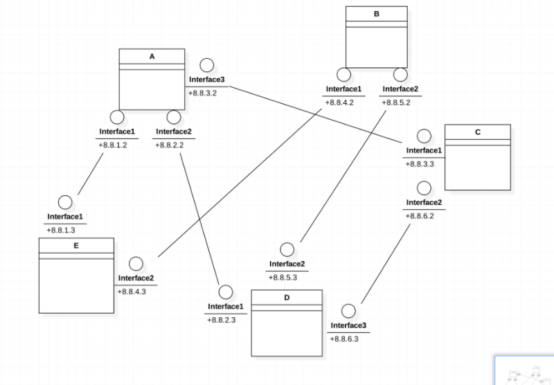

# 使用tcp模拟链路层

这里写一下如何使用tcp来模拟链路层的实现。

## 适用网络物理拓扑结构

注意，为了简化问题，下面的链路层的实现仅限于这样的网络拓扑结构。

1. 多台路由器之间通过网线直连，中间没有其他的主机。



## 接口

链路层应该给网络层提供以下接口

### 发送网络层的数据

网络层有IP包需要发送的时候，会将IP包送至链路层进行发送。
链路层会屏蔽线路中的各种细节，将该IP包发送至对应IP的主机。

1. 子网内不同IP地址的主机之间数据的发送

```py
DataLinkLayer.send(ip_pkg: bytes) -> error_code : int
# 将这个ip_pkg从该主机发往另一个主机
```

其中链路层会读取ip_pkg中的源ip和目的ip，并且尝试发送。
其中src_host是本机ip，dest_host是需要发送的主机的ip。

### 将链路层上收到的IP包向上交给网络层

链路层上的多个端口，都可能会收到IP包，链路层的工作是将这些IP包向上发送至网络层，由网络层进行解析。

```py
DataLinkLayer.recvive()  -> ip_pkb : bytes
# 阻塞式收取IP包，会收到一个bytes类型的IP包
```

## IP package的格式

链路层应该按照以下的方式解析IP package，获取源ip和目的ip
注意：网络层保证给到链路层的ip包中的源IP和目的IP在同一个子网内。

参考标准IP数据包的格式


其中选项固定为空，即没有

于是ip包的首部大小为5*32比特

|比特范围|值|
|-|-|
|0-15|/|
|16-31|数据包长度|
|32-47|/|
|48-63|子网比特数|
|64-95|/|
|96-127|源IP地址|
|128-159|目的IP地址|

## 链路层底层实现

TODO:

### 