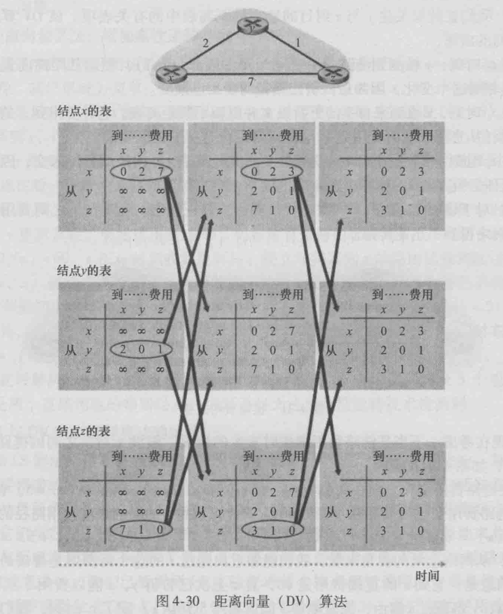

# 个人报告

## 我的贡献

本次实验中，我的贡献是：

1. 实现虚拟链路层（src/link.py）
2. 实现RIP路由协议（src/rip.py）
3. 完成虚拟链路层和RIP路由协议有关的实验报告，实验报告中详细介绍了两者的功能、设计思路和具体实现，因此在这里不再重复。

## 感想

本次实验中，首先进行了充分的讨论，想出了路由协议->网络层->虚拟链路层分层实现的项目架构。这种设计有两点优点：

1. 实现了程序的模块化，各模块之间的耦合几乎仅有send和receive两个函数。这使得我们三个人能够均分任务，减少了每个人的负担，提高了编码效率。
2. 在虚拟链路层实现了现实世界和我们的虚拟网络架构之间的隔离与抽象。使得网络层及以上的层级仿佛工作真正的路由设备上。

我认为本次实验的难点在于各个层级上的抽象：

1. 将socket抽象为物理层网线
2. 将Host结构体抽象为链路层上路由器的一个Interface
3. 将一个进程抽象为网络层的路由器

明确这种抽象关系花了我们不少时间。就是明确了后，它依旧给我们的小组合作和实验报告的撰写带来了语言表述上的困难。

实现RIP协议的过程难度也是高于预期的，我是照着课本有关dv算法和rip协议的介绍来实现的，然而课本对rip的介绍并没有协议工作流程的具体细节，其实就仅仅让我知道了要隔一段时间向邻居发送RIP报文。所以一开始我的思路并不清晰，通过多次尝试才成功将对RIP报文的处理划分为五个步骤，并最终实现了能正确计算最短路径、配置路由表、处理路由器下线和链路费用动态改变的RIP协议。

课本中有关dv算法的例子其实是具有误导性的：如下图，似乎距离向量和距离表是固定大小，一开始就建好的，后来只是不断更新里面的值。然而我们观察网络拓扑可以发现：例子中仅仅有三个路由器，每个路由器只有两个Interfaces，形成了两两互联的三角形拓扑。这就导致每个路由器从一开始就是有足够的关于整个网络的拓扑信息的！而稍大的网络就不会有这种初始条件。因此作为一种分布式协议，RIP协议必须要通过邻居间的RIP广播交换和学习有关网络拓扑的信息，动态改变距离向量/距离表的长度或大小。

