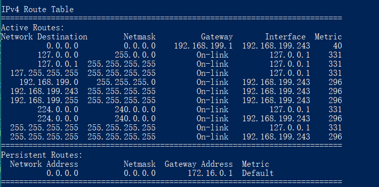

# 路由模块

这里放一下关于路由模块的实现方法。

## 路由模块维护的数据


### 各数据功能说明

1. 转发表
    1. 说明哪些子网是直连的（这个可以在初始化interface的时候设置）

下图是window的转发表


```py
class RouteTable():
    def __init__(self):
        """ 是否使用字典还不好说，我觉得可以使用pandas的Dataframe，会更加好用一些"""
        self.route_table = {}
    
    def init_local_link():
        """ 传入什么参数我还不确定，估计是列表或字典，在route模块里弄好就传进来吧 """
    
    def update_local_link(sub_net : str, net_mask: int):
        """ 在转发表中增加本地直连的子网列表 """
        update_item(sub_net, net_mask, 'on-link')

    def update_item(sub_net : str, net_mask : int, dest_ip :str):
        """ 如果子网在表中已存在，就替换之，否则添加表项 """

    def get_next_ip(sub_net :str, net_mask : int):
        """ 传入子网, 得到下一跳ip """
        # TODO:如果传入了本地直连的子网，会返回什么呢？可参考上图的gateway项
    
    def delete_item(sub_net : str, net_mask : int):
        """ 删除一个表项 """

```

### 数据的动态维护

1. 初始化后基本保持不变的
    1. `name`路由名称
    1. `index`路由编号

1. 在网络线路拓扑结构出现变化时需要更新的
    1. `interfaces`在接上新网线或者断开网线的时候需要更新
    1. `index2ip`同上
    1. 转发表

1. 网络线路代价出现变化
    1. 转发表

## 关键：转发表

通过这个表，我们可以知道，为了去到目的子网，需要去到哪一个目的IP。

表中只有三项

|索引|内容|内容|
|-|-|-|
|子网IP|子网掩码|目的IP|

##  自治系统（AS），内部网关协议

1. 自治系统
    1. 在相同的AS中的路由全部运行同样的路由选择算法
1. 网关路由器
    1. 自治系统间有一个网关路由器
1. 内部网关协议
    1. 路由选择信息协议（RIP）
    1. 开放最短路优先（OSPF）

### RIP路由选择信息协议

距离向量

### OSPF

核心：就是一个使用洪泛链路状态信息的链路状态协议和一个Dijkstra最低费用路径算法。

路由器在本地运行Dijkstra最短路径算法，确定一个以自身为根节点的到**所有子网**的最短路径。

#### 报文类型

由IP报文承载，IP报文中上层协议的值为89

1. Hello包 HELLO
    1. 
1. 数据库描述包 DBD
1. 链路状态请求包 LSR
1. 链路状态更新包 LSU
    1. OSPF包类型为4
    1. 1类router lsa：由所有的ospf路由器都会产生，只在区域内传播，包括路由器自身的接口信息，用于描述所有运行OSPF接口的链路状态开销，链路状态ID为始发本LSA的路由器ID，通告路由器ID为始发该LSA的路由器ID。
    1. 2类network lsa：由DR产生，用于描述与DR相连的所有路由器的信息，只在区域内传播，包括DR本身，链路状态ID为DR的接口IP，通告路由器ID为DR的路由器ID。
1. 链路状态确认包 LSAck


#### 数据库

链路状态数据库（LSDB）用来保存当前网络拓扑结构，路由器上属于同一区域的链路状态数据库是相同的（属于多个区域的路由器会为每个区域维护一份链路状态数据库）。